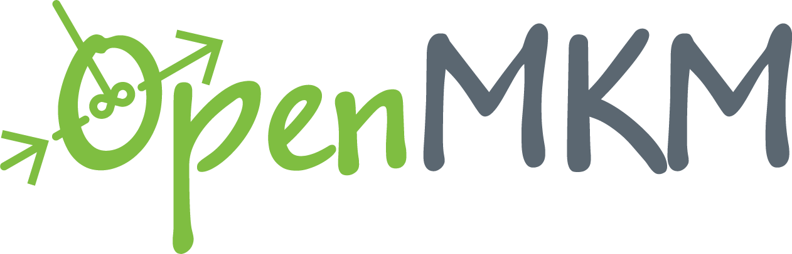

# OpenMKM

OpenMKM is a multiphysics and multiscale software aimed at Chemical Engineers
interested in modeling chemical kinetics for heterogeneous catalytic reactions.
OpenMKM is opensource software and is developed at Delaware Energy Institute,
University of Delaware.

# Documentation
To find more about OpenMKM, visit [OpenMKM Documentation][doc_page].

# GitHub Markdown (.md) documentation
1. Instructions how to install OpenMKM can be found at [Installation](docs/install.md).
2. Instructions to run OpenMKM can be found at [How-to-run](docs/run.md). 
3. More information about the input files required to run OpenMKM can be found at [Input-Files](docs/input.md). 
4. More information about the output files generated by OpenMKM can be found at [Output-Files](docs/output.md). 
5. You can find micro-kinetic modeling theory at in the [Theory](docs/theory.md) section. 
6. Examples are given here: [*\<OpenMKM\_ROOT\>/examples/* folder][examples]

# Developers
- Bharat Medasani (mbkumar@gmail.com)
- Sashank Kasiraju (skasiraj@udel.edu)

# Dependencies
OpenMKM is dependent on [Cantera][cantera_page].

# License
MIT License

# Funding
Development of OpenMKM is funded by [RAPID Manufacturing Institute][rapid_page].

[doc_page]: https://vlachosgroup.github.io/openmkm/
[cantera_page]: http://www.cantera.org
[rapid_page]: http://www.aiche.org/rapid
[examples]: https://github.com/VlachosGroup/openmkm/tree/master/examples
